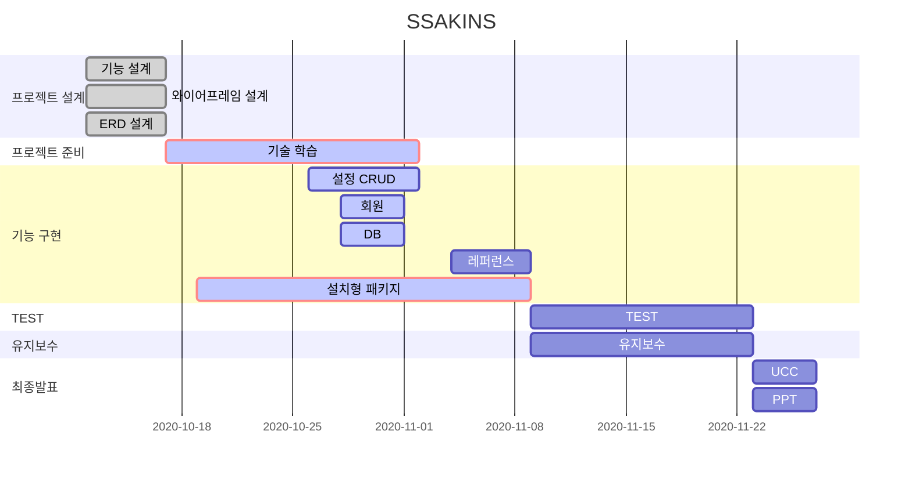

# SSAKINS

#### 웹에서 간단히 옵션 선택으로 사용자가 만족하는 CI/CD 환경을 설치형 패키지 형태로 편리하게 제공하는 웹 서비스


##### :bust_in_silhouette: 박형민 (팀장 / 백엔드 & 인프라)

##### :bust_in_silhouette: 이유진 (팀원 / 테크리더 & 프론트엔드)

##### :bust_in_silhouette: ​이채영 (팀원 / 기획 & 백엔드 & 인프라)

##### :bust_in_silhouette: 임진섭 (팀원 / QA & UCC 담당자 & 프론트엔드)

##### :bust_in_silhouette: ​최현수 (팀원 / 백엔드 & 인프라)

<br>

<br>

## :runner: 기능 소개


<br>

#### Login Page


#### Home Page


#### Create Page


#### Detail Page


#### Detail Page - info


<br>

<br>


## :keyboard: Code Style

<br>

### :page_with_curl: Java

<br>

#### Naming

 + Class는 첫글자 대문자 + camel case
    + ex) MainController.java
 + Method 나 Variable은  첫글자 소문자 + camel case
    + ex) public void setUserName(); / private String userName;
 + 이름만으로 기능이나 특성 유추 할 수 있게 명명하기

#### Statement

+ if

  + 한줄 일 때, Block 처리하기

  + else if / else /중괄호는 조건문 바로 옆에 붙이기

    + ```java
      if(condition){
      	statement;
      } else if(condition2){
      	statement2;
      } else{
      	statement3;
      }
      ```

+ for 
  
  + 단순 반복문은 iterator를 i, j, k, ... ,z 순으로 명명 하기


+ Null check 하기
  + Optional 지향 + Null 상황 대응하기
+ Method Chaining
  + 체이닝 한 메소드 당 줄 바꾸기

#### Comment

+ 기본적으로 한글로 달기
+ 주석처리된 코드 사유 적고 작성자가 책임지고 지우기
+ /**/ 을 이용해서 위에다가 쓰기
+ 간단한 설명은 옆에 // 주석 쓰기


<br>

### :page_with_curl: ​Javascript

<br>

#### Naming

+ var 변수보다 let 변수 사용 지향하기


#### Statement

+ 들여쓰기 : 2칸
+ callback 함수 사용 시, arrow function 사용하기

#### Comment

+ html, css 에서는<!-- -->로 주석 처리하기

<br>

<br>


## :speech_balloon: Commit message

[BE/FE/FS] initial/update | 내용 | Jira 이슈 번호

> BE : 백  
> FE : 프론트  
> FS : 풀스택  


README(이름)

<br>

<br>

## :straight_ruler: Branch 규칙

feature/기능명 으로 develop에서 분기해서 사용하고, 기능 개발 완료 후 develop에 머지!

<br>

<br>

## :hammer: Stack

     
  

    

   


   

<br>

<br>

## :bar_chart: Gantt Chart



<br>

<br>

## :file_folder: File Directory

```
├── backend
|  ├── pom.xml
|  └── src
|     ├── main
|     |  ├── java
|     |  |  └── com
|     |  |     └── ssafy
|     |  |        └── ssakins
|     |  |           ├── controller
|     |  |           |  ├── AccountController.java
|     |  |           |  ├── DownloadController.java
|     |  |           |  └── ProjectController.java
|     |  |           ├── dto
|     |  |           |  ├── AccountAndProject.java
|     |  |           |  └── AccountInfo.java
|     |  |           ├── entity
|     |  |           |  ├── Account.java
|     |  |           |  ├── Command.java
|     |  |           |  ├── CommandType.java
|     |  |           |  ├── Credential.java
|     |  |           |  ├── CredentialKind.java
|     |  |           |  ├── Git.java
|     |  |           |  ├── GlobalTool.java
|     |  |           |  ├── Plugin.java
|     |  |           |  ├── PluginKind.java
|     |  |           |  ├── Project.java
|     |  |           |  ├── Server.java
|     |  |           |  ├── ServerKind.java
|     |  |           |  └── SSHServer.java
|     |  |           ├── repository
|     |  |           |  └── AccountRepository.java
|     |  |           └── SsakinsApplication.java
|     |  └── resources
|     |     ├── application-live.properties
|     |     ├── application-test.properties
|     |     ├── application.properties
|     |     ├── default
|     |     |  ├── item
|     |     |  |  └── jobs.item.config.xml
|     |     |  ├── ssakins_home
|     |     |  |  ├── hudson.plugins.git.GitTool.xml
|     |     |  |  ├── hudson.plugins.gradle.Gradle.xml
|     |     |  |  ├── hudson.tasks.Maven.xml
|     |     |  |  └── jenkins.plugins.nodejs.tools.NodeJSInstallation.xml
|     |     |  └── xml
|     |     |     ├── com.dabsquared.gitlabjenkins.connection.GitLabConnectionConfig.xml
|     |     |     ├── config.xml
|     |     |     ├── credentials.xml
|     |     |     ├── github-plugin-configuration.xml
|     |     |     └── jenkins.plugins.publish_over_ssh.BapSshPublisherPlugin.xml
|     |     ├── sh
|     |     |  ├── addGlobalTool.sh
|     |     |  ├── com.dabsquared.gitlabjenkins.connection.GitLabConnectionConfig.xml
|     |     |  ├── config.xml
|     |     |  ├── credential.Encrypt.groovy
|     |     |  ├── credential.Encrypt.test.groovy
|     |     |  ├── credentials.xml
|     |     |  ├── downloadZip.sh
|     |     |  ├── github-plugin-configuration.xml
|     |     |  ├── hudson.plugins.git.GitTool.xml
|     |     |  ├── hudson.plugins.gradle.Gradle.xml
|     |     |  ├── hudson.tasks.Maven.xml
|     |     |  ├── installJdk.groovy
|     |     |  ├── installJDK.sh
|     |     |  ├── installPlugin.sh
|     |     |  ├── jenkins.plugins.nodejs.tools.NodeJSInstallation.xml
|     |     |  ├── jenkins.plugins.publish_over_ssh.BapSshPublisherPlugin.xml
|     |     |  ├── jobs.item.config.xml
|     |     |  ├── jobs.item.xml
|     |     |  └── killDocker.sh
|     |     └── static
|     |        └── ssakins
|     |           ├── config.xml
|     |           ├── deploy
|     |           |  ├── config.xml
|     |           |  ├── deploy-spring.sh
|     |           |  ├── deploy-vue.sh
|     |           |  ├── Dockerfile-ssakins-spring
|     |           |  └── nginx.conf
|     |           ├── install.sh
|     |           └── ssakins_home
|     |              ├── com.cloudbees.hudson.plugins.folder.config.AbstractFolderConfiguration.xml
|     |              ├── com.dabsquared.gitlabjenkins.connection.GitLabConnectionConfig.xml
|     |              ├── config.xml
|     |              ├── copy_reference_file.log
|     |              ├── credentials.xml
|     |              ├── github-plugin-configuration.xml
|     |              ├── hudson.model.UpdateCenter.xml
|     |              ├── hudson.plugins.git.GitTool.xml
|     |              ├── hudson.plugins.gradle.Gradle.xml
|     |              ├── hudson.tasks.Maven.xml
|     |              ├── identity.key.enc
|     |              ├── jenkins.install.InstallUtil.lastExecVersion
|     |              ├── jenkins.install.UpgradeWizard.state
|     |              ├── jenkins.plugins.nodejs.tools.NodeJSInstallation.xml
|     |              ├── jenkins.plugins.publish_over_ssh.BapSshPublisherPlugin.xml
|     |              ├── jenkins.telemetry.Correlator.xml
|     |              ├── jobconfig.xml
|     |              ├── logs
|     |              |  └── tasks
|     |              |     ├── Download metadata.log
|     |              |     ├── Download metadata.log.1
|     |              |     └── Periodic background build discarder.log
|     |              ├── nodeMonitors.xml
|     |              ├── plugins
|     |              ├── remoteDirectory
|     |              ├── secret.key
|     |              ├── secret.key.not-so-secret
|     |              ├── secrets
|     |              |  ├── filepath-filters.d
|     |              |  |  └── 30-default.conf
|     |              |  ├── initialAdminPassword
|     |              |  ├── jenkins.model.Jenkins.crumbSalt
|     |              |  ├── master.key
|     |              |  ├── org.jenkinsci.main.modules.instance_identity.InstanceIdentity.KEY
|     |              |  ├── slave-to-master-security-kill-switch
|     |              |  └── whitelisted-callables.d
|     |              |     └── default.conf
|     |              ├── ssakins-credentials.sh
|     |              ├── ssakins-github-plugin-configuration.sh
|     |              ├── ssakins-jdk.sh
|     |              ├── ssakins-job.sh
|     |              ├── ssakins-lab.sh
|     |              ├── ssakins-setting.sh
|     |              ├── ssakins-ssh.sh
|     |              ├── updates
|     |              |  ├── default.json
|     |              |  ├── hudson.plugins.gradle.GradleInstaller
|     |              |  ├── hudson.tasks.Ant.AntInstaller
|     |              |  ├── hudson.tasks.Maven.MavenInstaller
|     |              |  └── hudson.tools.JDKInstaller
|     |              ├── userContent
|     |              |  └── readme.txt
|     |              ├── users
|     |              |  ├── admin_7891938921943054339
|     |              |  |  └── config.xml
|     |              |  └── users.xml
|     |              └── war
|     └── test
|        └── java
|           └── com
|              └── ssafy
|                 └── ssakins
|                    └── SsakinsApplicationTests.java
└── frontend
   ├── node_modules
   ├── package-lock.json
   ├── package.json
   ├── public
   |  ├── favicon.ico
   |  ├── index.html
   |  ├── ssakins.ico
   |  ├── ssakins.png
   |  └── ssakins_logo.jpg
   └── src
      ├── App.vue
      ├── assets
      |  ├── error.png
      |  ├── kakao_login_large_narrow.png
      |  ├── logo.png
      |  ├── logo.svg
      |  ├── ssakins.jpg
      |  ├── test.png
      |  └── tetris.mp3
      ├── components
      |  ├── CredentialForm.vue
      |  ├── Header.vue
      |  ├── LoginComponent.vue
      |  ├── Navigator.vue
      |  └── ServerForm.vue
      ├── main.js
      ├── plugins
      |  └── vuetify.js
      ├── router
      |  └── index.js
      ├── store
      |  └── index.js
      └── views
         ├── Create.vue
         ├── Detail.vue
         ├── Edit.vue
         ├── Game.vue
         ├── Home.vue
         ├── Main.vue
         ├── PageNotFound.vue
         ├── Reference.vue
         ├── TermsOfUse.vue
         └── Test.vue
```

<br>

<br>