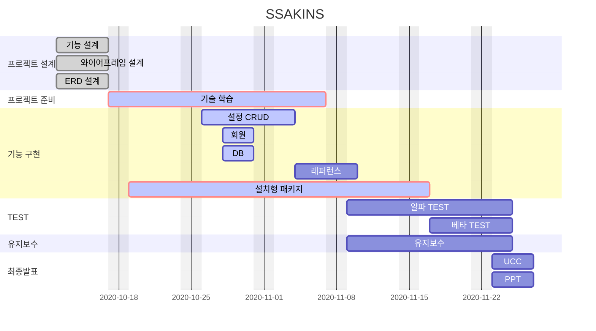
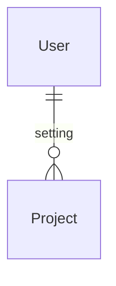

# SSAKINS


## Code Style


### Java


#### Naming

 + Class는 첫글자 대문자 + camel case
    + ex) MainController.java
 + Method 나 Variable은  첫글자 소문자 + camel case
    + ex) public void setUserName(); / private String userName;
 + 이름만으로 기능이나 특성 유추 할 수 있게 명명하기

#### Statement

+ if

  + 한줄 일 때, Block 처리하기

  + else if / else /중괄호는 조건문 바로 옆에 붙이기

    + ```java
      if(condition){
      	statement;
      } else if(condition2){
      	statement2;
      } else{
      	statement3;
      }
      ```

+ for 
  
  + 단순 반복문은 iterator를 i, j, k, ... ,z 순으로 명명 하기


+ Null check 하기
  + Optional 지향 + Null 상황 대응하기
+ Method Chaining
  + 체이닝 한 메소드 당 줄 바꾸기


#### Comment

+ 기본적으로 한글로 달기
+ 주석처리된 코드 사유 적고 작성자가 책임지고 지우기
+ /**/ 을 이용해서 위에다가 쓰기
+ 간단한 설명은 옆에 // 주석 쓰기


### Javascript

#### Naming

+ var 변수보다 let 변수 사용 지향하기

  

#### Statement

+ 들여쓰기 : 2칸
+ callback 함수 사용 시, arrow function 사용하기

#### Comment

+ html, css 에서는<!-- -->로 주석 처리하기


---


## Commit message

[BE/FE/FS] initial/update | 내용 | Jira 이슈 번호

> BE : 백  
> FE : 프론트  
> FS : 풀스택  


README(이름)


## Branch 규칙

feature/기능명 으로 develop에서 분기해서 사용하고, 기능 개발 완료 후 develop에 머지!


## Stack


     
  

    

   


   


## Gantt Chart




## ERD



